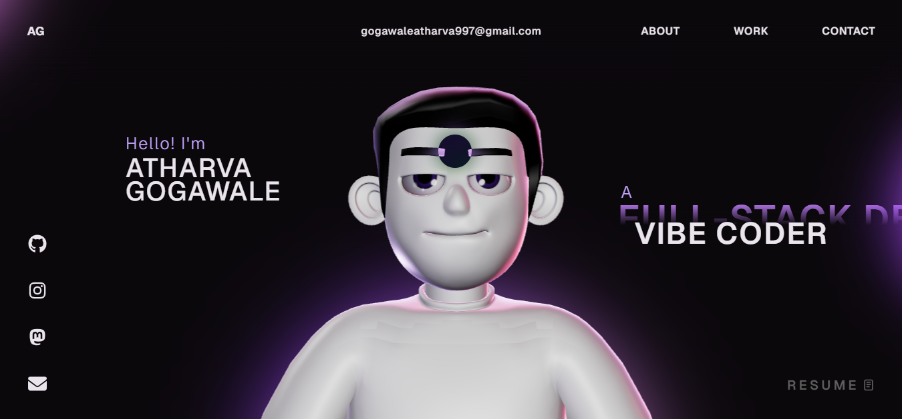

# 🚀 Atharva Gogawale Portfolio


> BCA Student | Full Stack Developer | Data Analytics Enthusiast | Cloud Learner

A modern and interactive developer portfolio showcasing my projects, technical skills, certifications, and achievements. Built with modern web technologies to provide a smooth and engaging user experience.

---

## 🌟 About Me

Hi, I'm **Atharva Gogawale**, a BCA student passionate about software development, web technologies, data analytics, and cloud computing.

I enjoy building real-world applications that solve practical problems while continuously learning new technologies and improving my development skills.

---

## ✨ Features

* Modern Responsive Design
* Interactive 3D Elements
* Smooth Animations
* Project Showcase
* Skills & Certifications Section
* Contact Information & Social Links
* Optimized Performance
* Mobile Friendly Experience

---

## 💻 Tech Stack

### Frontend

* React
* TypeScript
* HTML5
* CSS3
* JavaScript
* Three.js
* GSAP

### Backend & Database

* Node.js
* Firebase
* MongoDB
* MySQL

### Cloud & Deployment

* AWS
* Azure
* Google Cloud
* Vercel
* Netlify

### Tools

* Git & GitHub
* Docker
* Figma
* Power BI
* Notion

---

## 🚀 Featured Projects

### 🎓 Smart Attendance Web App

A smart attendance management platform designed for educational institutions with real-time tracking and analytics.

**Tech:** TypeScript, Firebase, React

---

### 📚 EduLearn LMS

A Learning Management System that allows students to access educational resources through a user-friendly interface.

**Tech:** HTML, CSS, JavaScript, Firebase

---

### 🩸 HemoLink – Blood Donor Finder

A web application connecting blood donors and recipients through a modern and responsive platform.

**Tech:** HTML, CSS, JavaScript

---

## 🏆 Certifications

* Deloitte Australia – Technology Job Simulation
* Deloitte Australia – Cyber Job Simulation
* Tata Cybersecurity Analyst Job Simulation
* Tata Data Visualisation Job Simulation
* Prompt Engineering Certification
* HTML Fundamentals Certification
* NISM Financial Literacy Course
* GDG Hackathon Participation Certificate

---

## 📈 Current Focus

* Full Stack Development
* AI-Powered Applications
* Data Analytics & Power BI
* Cloud Computing
* Open Source Contributions

---

## 🛠️ Installation

Clone the repository:

```bash
git clone https://github.com/Atharv-0700/Atharva-portfolio.git
```

Navigate to the project folder:

```bash
cd Atharva-portfolio
```

Install dependencies:

```bash
npm install
```

Start the development server:

```bash
npm run dev
```

Build for production:

```bash
npm run build
```

---

## 📬 Connect With Me

### GitHub

https://github.com/Atharv-0700

### LinkedIn

https://www.linkedin.com/in/atharva-gogawale-259173354/

### Email

[gogawaleatharva997@gmail.com](mailto:gogawaleatharva26@gmail.com)

### Instagram

https://www.instagram.com/athgo7002

---

## ⭐ Support

If you like this project:

* Star the repository
* Follow my GitHub profile
* Connect with me on LinkedIn
* Share feedback and suggestions

---

## 📄 License

This project is licensed under the MIT License.

---

### Designed & Developed by Atharva Gogawale © 2026
